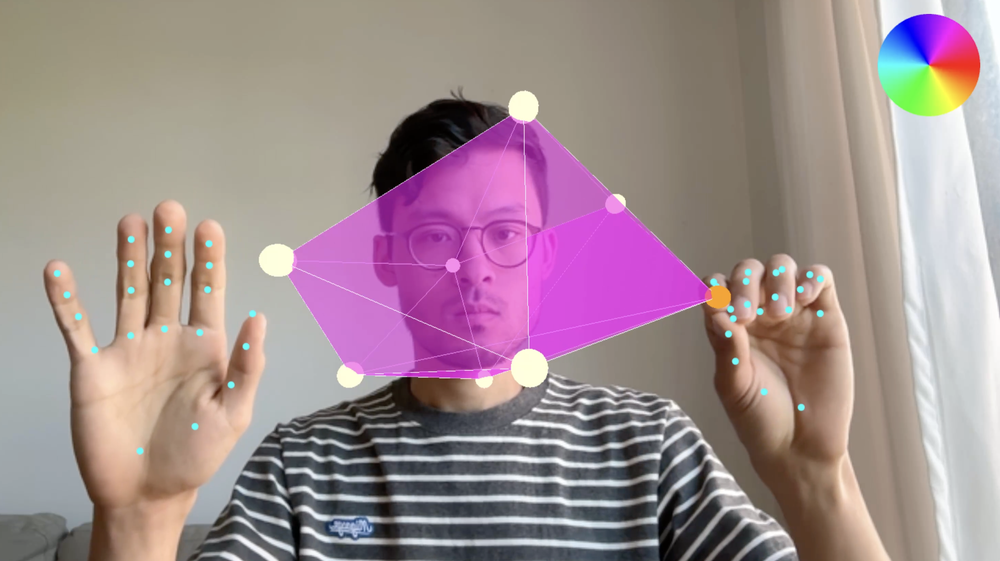

# 3D Shape Editor [Threejs / MediaPipe Demo]

Edit 3D shapes with natural hand gestures.

* right hand: pinch to grab / move a corner of the cube
* pinch and drag in the color wheel
* left hand: make a fist and move to rotate the shape

Built with threejs / WebGL / MediaPipe.

[Video](https://youtu.be/QtXScN6vgw4) | [Live Demo](https://www.funwithcomputervision.com/demo3/)



## Setup for Development

```bash
# Navigate to the project sub-folder
#(follow the steps on the main page to clone all files if you haven't already done so)
cd 3d-editor

# Serve with your preferred method (example using Python)
python -m http.server

# Use your browser and go to:
http://localhost:8000
```

## Requirements

- Modern web browser with WebGL support
- Camera access

## Technologies

- **Three.js** for 3D rendering
- **MediaPipe** for hand tracking and gesture recognition
- **HTML5 Canvas** for visual feedback
- **JavaScript** for real-time interaction

## Key Learnings

[work in progress, to be added]