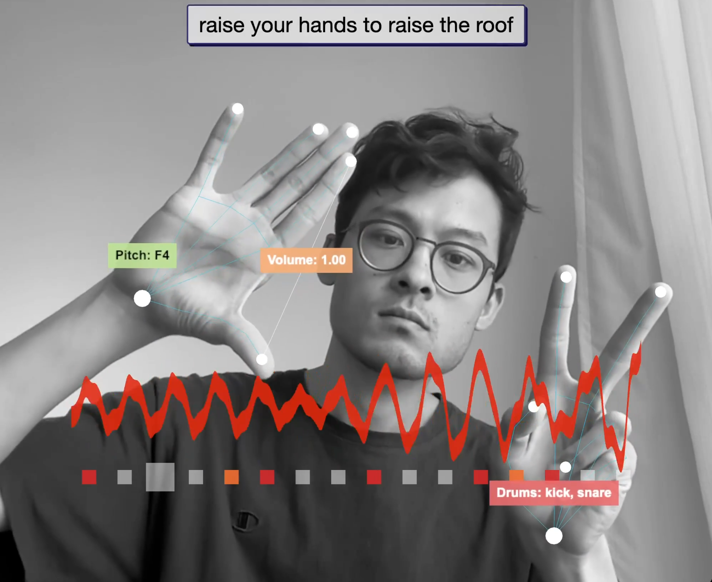

# Hand Gesture Arpeggiator

Hand-controlled arpeggiator, drum machine, and audio reactive visualizer. Raise your hands to raise the roof!

An interactive web app built with threejs, mediapipe computer vision, rosebud AI, and tone.js.

- Hand #1 controls the arpeggios (raise hand to raise pitch, pinch to change volume)
- Hand #2 controls the drums (raise different fingers to change the pattern)

[Video](https://youtu.be/JepIs-DTBgk) | [Live Demo](https://www.funwithcomputervision.com/demo5/)



## Setup for Development

```bash
# Navigate to the project sub-folder
#(follow the steps on the main page to clone all files if you haven't already done so)
cd arpeggiator

# Serve with your preferred method (example using Python)
python -m http.server

# Use your browser and go to:
http://localhost:8000
```

## Requirements

- Modern web browser with WebGL support
- Camera access enabled for hand tracking

## Technologies

- **MediaPipe** for hand tracking and gesture recognition
- **Three.js** for audio reactive visual rendering
- **Tone.js** for synthesizer sounds
- **HTML5 Canvas** for visual feedback
- **JavaScript** for real-time interaction

## Key Learnings

[work in progress, to be added]