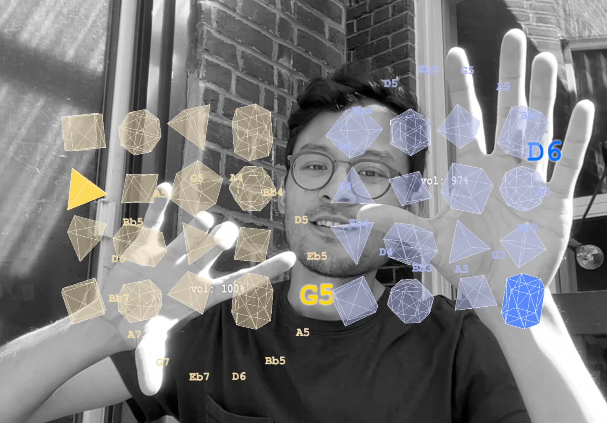

# Radial Music

Make music with hand movements.

A real-time interactive music application that tracks your hands through your webcam and generates ambient music based on hand rotation / movement.

[Live Demo](https://funwithcomputervision.com/radial/)



## Overview

1. **Hand Detection**: Uses your webcam to track up to 2 hands in real-time
3. **Rotation Control**: Hand rotation angle controls tempo and note changes
2. **Gesture Recognition**: pinch (thumb-to-index finger) to control volume
4. **Visual Feedback**: 3D shapes and note labels show what's currently playing
5. **Ambient Audio**: Generates layered synthesized music with reverb and delay effects

## 🛠️ Tech Stack

- **Hand Tracking**: MediaPipe (Google's machine learning framework)
- **3D Graphics**: Three.js for visual elements and shapes
- **Audio Synthesis**: Tone.js for real-time sound generation
- **Frontend**: Vanilla JavaScript (ES6 modules)
- **Styling**: CSS3 with modern effects

## 📁 File Structure

```
├── index.html          # Main HTML structure
├── main.js             # Core application logic
├── styles.css          # Styling and layout
└── README.md           # This file
```

## 🔧 Key Components

### Audio System
- **Polyphonic FM Synthesis**: Creates rich, layered sounds
- **Effects Chain**: Reverb → Chorus → Filter → Delay
- **Two Sound Profiles**: Different synthesis parameters for each hand
- **Auto-cleanup**: Prevents stuck notes and audio glitches

### Hand Tracking
- **MediaPipe Integration**: Google's pre-trained hand detection model
- **Gesture Smoothing**: Filters out jittery movements
- **Multi-hand Support**: Tracks left and right hands independently
- **Performance Optimized**: Throttled updates to maintain 30fps

### Visual Engine
- **Three.js Renderer**: Hardware-accelerated 3D graphics
- **Object Pooling**: Reuses materials and geometries for performance
- **Dynamic Text**: Real-time note labels and volume indicators
- **Geometric Shapes**: Different 3D shapes for each note in the grid
