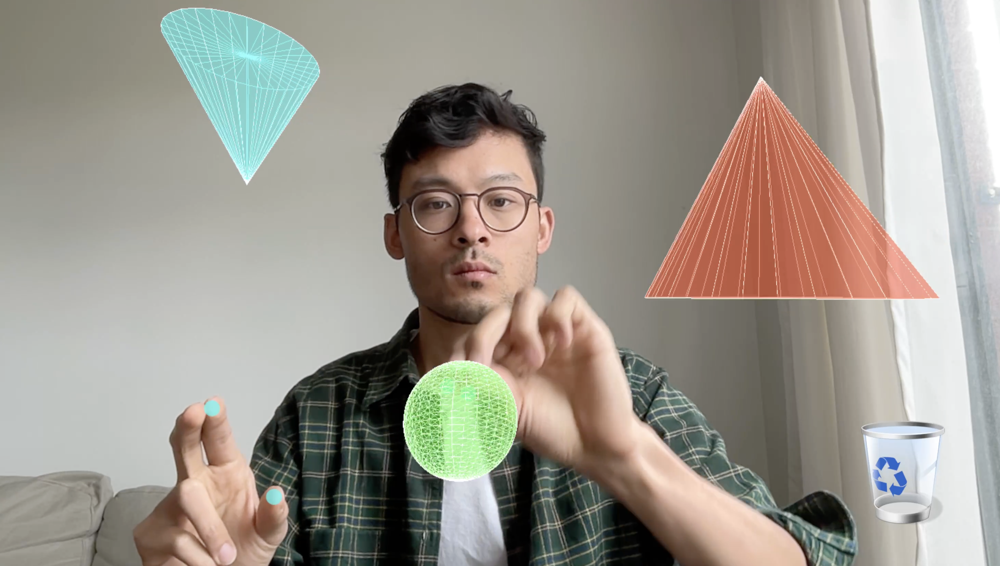

# 3D Shape Creator

A threejs / WebGL / MediaPipe-powered interactive demo that allows you to control create and move 3D shapes using hand gestures in real-time.

[Video](https://youtu.be/oE3a0ghsrBk) | [Live Demo](https://www.funwithcomputervision.com/demo2/)



## Setup for Development

```bash
# Navigate to the project sub-folder
#(follow the steps on the main page to clone all files if you haven't already done so)
cd shape-creator

# Serve with your preferred method (example using Python)
python -m http.server

# Use your browser and go to:
http://localhost:8000
```

## Requirements

- Modern web browser with WebGL support
- Camera access

## Technologies

- **Three.js** for 3D rendering
- **MediaPipe** for hand tracking and gesture recognition
- **HTML5 Canvas** for visual feedback
- **JavaScript** for real-time interaction

## Key Learnings

[work in progress, to be added]