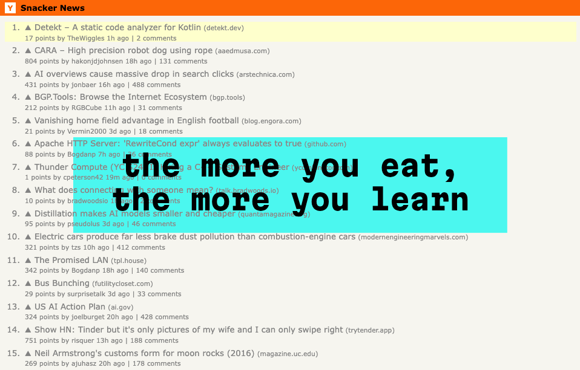

# Snacker News 🥨

A hands-free Hacker News browser that uses speech recognition and face detection to navigate articles without touching your keyboard or mouse.

[Video]() | [Live Demo](https://www.funwithcomputervision.com/snacker-news/)

## How It Works

**Main Feed Navigation:**
1. Say **"Next"** to highlight the next article
2. Say **"Open"** to read the currently highlighted article  
3. Say **"1" through "20"** to jump to a specific article number

**Article Reading:**
1. **Open your mouth** 😮 to scroll down through the article
2. Say **"Back"** to return to the main feed

## Step-by-Step Overview

### 1. **Setup Phase**
- Requests camera and microphone permissions
- Loads MediaPipe face detection models
- Fetches top 20 stories from Hacker News API
- Starts continuous speech recognition

### 2. **Face Detection**
- Uses **MediaPipe** to detect face landmarks in real-time
- Calculates mouth opening ratio (height vs width)
- When mouth opens wide enough → triggers scroll down
- Only works when reading an article (not on main feed)

### 3. **Speech Recognition** 
- Listens continuously for voice commands
- Processes commands like "next", "open", "back", and numbers
- Updates visual feedback (blue border when speaking)

### 4. **Article Loading**
- Pre-fetches article content in background for faster loading
- Uses multiple proxy services to bypass CORS restrictions
- Extracts readable content and removes ads/navigation
- Falls back to iframe if proxy methods fail

### 5. **Visual Feedback**
- **Orange border**: Mouth is open (scrolling)
- **Blue border**: Currently speaking  
- **Yellow highlights**: Shows which commands work in current view

## Technologies Used

- **MediaPipe** - Google's face detection library for mouth tracking
- **Web Speech API** - Browser's built-in speech recognition
- **Hacker News API** - Fetches latest stories
- **Proxy Services** - Bypasses website CORS restrictions to load articles
- **Vanilla JavaScript** - No frameworks, just plain JS
- **CSS3** - Styling and visual effects

## Files Structure

- `index.html` - Main page layout and meta tags
- `main.js` - Core application logic (750+ lines)
- `styles.css` - All styling for the interface

## Fallback Controls

If face detection fails:
- **Spacebar** or **click video** to scroll articles
- All speech commands still work normally

---

*Everything runs locally in your browser - no data is stored or sent to servers.*